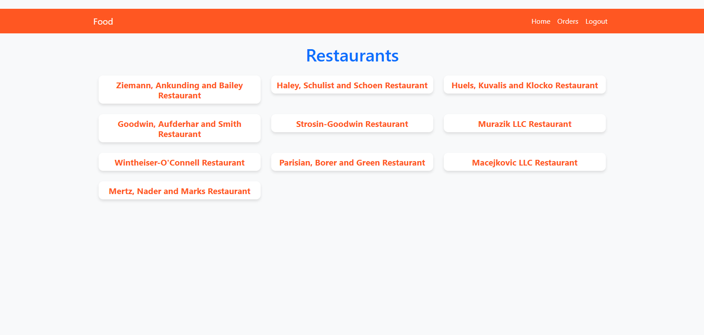
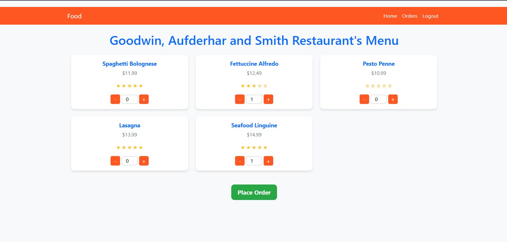
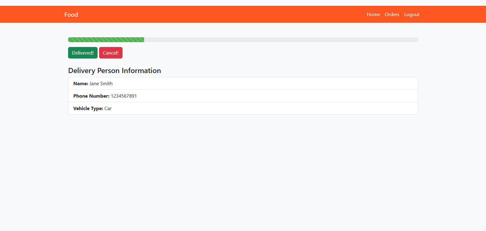
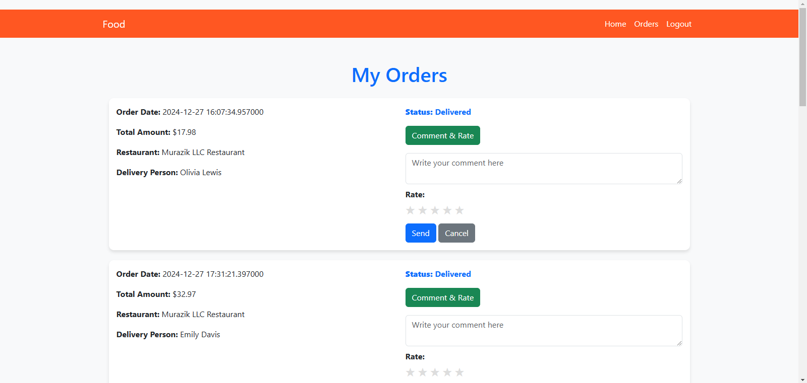

# 🍔 Food Delivery App

A modern and feature-rich food delivery web application built using Flask. Users can browse restaurants, order food, and track their orders seamlessly. Restaurant owners can manage their menus, and admins oversee the platform. 

## 🚀 Features

✅ **User Authentication & Authorization** (Customers, Restaurant Owners, Admins)  
✅ **Restaurant & Menu Management**  
✅ **Order Placement & Tracking**  
✅ **Ratings & Reviews for Food Items**  
✅ **Cart System with Quantity Selection**  
✅ **Responsive UI with Bootstrap**

---

## 📸 Screenshots

### 🏠 Home Page
> A list of all available restaurants



### 🍽️ Restaurant Menu
> Browse and add food items to the cart



### 🛒 Cart & Order Placement
> See your order details and its deliveryperson



### 📦 Order History & Review System
> Track orders and leave feedback for delivered items



---

## 🛠️ Technologies Used

- **Backend:** Flask, PyODBC, SQL Server
- **Frontend:** HTML, Bootstrap, JavaScript
- **Database:** SQL Server (Order & User Management)

---

## 🔧 Installation & Setup

1️⃣ Clone the repository:
```bash
 git clone https://github.com/yourusername/food-delivery-app.git
```

2️⃣ Install dependencies:
```bash
pip install -r requirements.txt
```

3️⃣ Set up the database (SQL Server):
- Create a Food database in SQL Server
- Run the SQL scripts in `sql_scripts/` folder to create tables
- Configure database connection in `app.py`

4️⃣ Start the application:
```bash
python app.py
```

5️⃣ Open in your browser:
```
http://127.0.0.1:5000
```

---

## 📌 Usage

- **Customers:** Register, browse restaurants, order food, track orders, and leave reviews.
- **Restaurant Owners:** Manage their menu and update food availability.
- **Admins:** Manage users, restaurants, and platform settings.

---

## 🙌 Contributing
Pull requests are welcome! Feel free to improve the UI, add features, or fix bugs. Fork the repo and submit a PR. 

---

💡 *This project was developed for learning purposes and as part of a university database lab course.*
